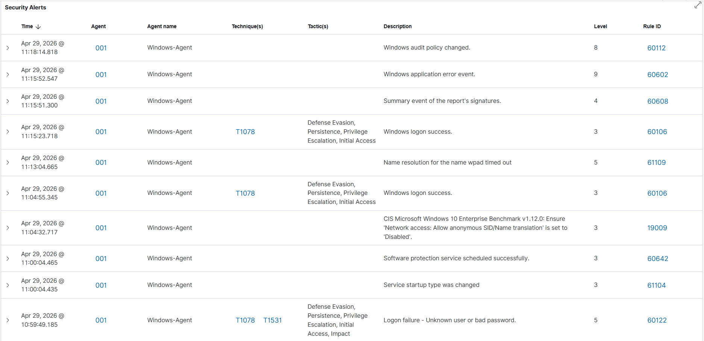

# 🛡️ Wazuh SIEM Home Lab — Attack Detection & Incident Response


## 📌 Project Overview

Built a fully functional Security Operations home lab by deploying 
Wazuh SIEM on Ubuntu Server and connecting a Windows 10 endpoint as 
a monitored agent. Simulated real-world attack techniques, triaged 
alerts, and documented findings in a structured incident report 
following a SOC L1 analyst workflow.

---

## 🛠️ Tools & Technologies

| Tool | Role |
|---|---|
| Wazuh 4.7.5 | SIEM / XDR Platform |
| Ubuntu Server 22.04 | Wazuh Server OS |
| Windows 10 | Monitored Endpoint |
| VirtualBox | Hypervisor |
| Nmap | Network Reconnaissance Simulation |
| PowerShell | Attack Simulation & Verification |

---

## ⚔️ Attacks Simulated

### 1. Brute Force Attack — T1110
**Tool:** PowerShell `net use` command  
**What happened:** Simulated 10 consecutive failed login attempts 
against the local administrator account  
**Wazuh Detection:** Event ID 4625 (Failed Logon) alerts triggered  
**MITRE Technique:** T1110 — Brute Force  

### 2. Network Reconnaissance — T1046
**Tool:** Nmap `-sV` service version scan  
**What happened:** Performed a service version scan against the 
Windows endpoint from the attacker machine  
**Wazuh Detection:** Network scan activity flagged  
**MITRE Technique:** T1046 — Network Service Discovery  

### 3. System & User Discovery — T1083 / T1087
**Tool:** PowerShell built-in cmdlets  
**Commands Run:**
```powershell
whoami /all
net user
Get-LocalUser
Get-ChildItem C:\Users\
```
**Wazuh Detection:** Event ID 4688 (Process Creation) logged  
**MITRE Techniques:** T1083 — File Discovery, T1087 — Account Discovery

---

## 📊 MITRE ATT&CK Coverage

| Technique ID | Name | Tactic | Detected |
|---|---|---|---|
| T1110 | Brute Force | Credential Access | ✅ |
| T1046 | Network Service Discovery | Discovery | ✅ |
| T1083 | File and Directory Discovery | Discovery | ✅ |
| T1087 | Account Discovery | Discovery | ✅ |

---

## 🔍 Key Findings & Alert Analysis

### Brute Force (Event ID 4625)
- 10 failed logon attempts detected within 60 seconds
- Source: Local machine (`\\localhost`)
- Target account: `administrator`
- **SOC Action:** Flag source IP, check for successful logon 
  following failed attempts (Event ID 4624)

### Process Execution (Event ID 4688)
- Suspicious enumeration commands logged under user context
- Commands mapped to Discovery tactic in MITRE ATT&CK
- **SOC Action:** Correlate with logon events to determine if 
  this follows a successful brute force

### Network Scan
- Nmap service version scan detected against Windows endpoint
- Multiple ports probed in short timeframe
- **SOC Action:** Identify scanning source, check if it's an 
  authorized asset, escalate if unknown

---

## 📸 Screenshots

### Wazuh Agent Active


### Brute Force Alerts — Event ID 4625


### Process Execution Logs — Event ID 4688


### MITRE ATT&CK Coverage Map


### Security Events Overview


---

## 📝 Incident Report

A structured incident report documenting all findings, 
timeline, and recommended response actions is available here:

📄 [View Incident Report](incident-report.md)

---

## 🧠 Skills Demonstrated

- ✅ SIEM deployment and configuration (Wazuh)
- ✅ Linux server administration (Ubuntu)
- ✅ Windows endpoint monitoring and agent deployment
- ✅ Attack simulation and purple team thinking
- ✅ Alert triage and investigation workflow
- ✅ MITRE ATT&CK framework mapping
- ✅ Incident documentation and reporting
- ✅ Network configuration (VirtualBox Host-Only)
- ✅ PowerShell scripting

---

## 📁 Repository Structure
wazuh-siem-homelab/
│
├── README.md                  ← This file
├── incident-report.md         ← Structured incident report
├── screenshots/
│   ├── 01-agent-active.png
│   ├── 02-brute-force-alerts.png
│   ├── 03-process-execution.png
│   ├── 04-mitre-attack-map.png
│   └── 05-security-overview.png
└── notes/
└── setup-notes.md         ← Personal notes during setup

---

## 🚀 How to Replicate This Lab

1. Install VirtualBox on host machine
2. Deploy Ubuntu Server 22.04 VM (3GB RAM, 25GB disk)
3. Install Wazuh using the official install script
4. Deploy Windows 10 VM (2GB RAM, 50GB disk)
5. Install Wazuh Agent on Windows, point to server IP
6. Simulate attacks using PowerShell and Nmap
7. Investigate alerts in Wazuh dashboard

Full setup guide coming soon.

---

## 👤 Author

**Shubham Singh Darmwal**  
Cyber Security Enthusiast | Aspiring SOC Analyst  
