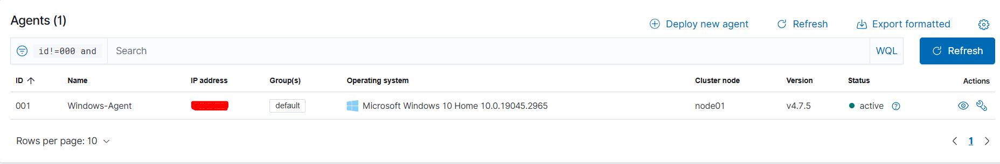
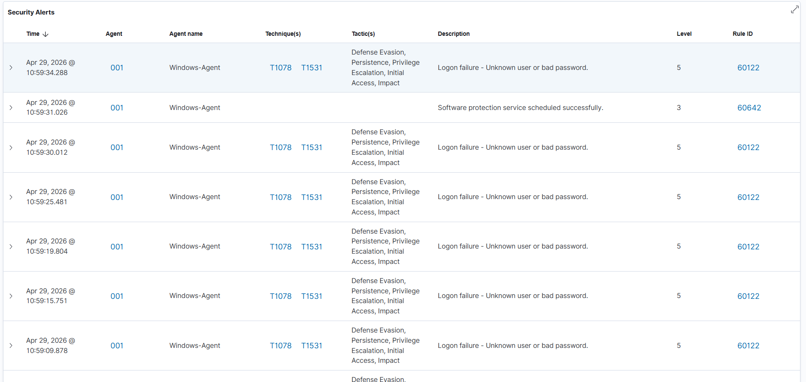
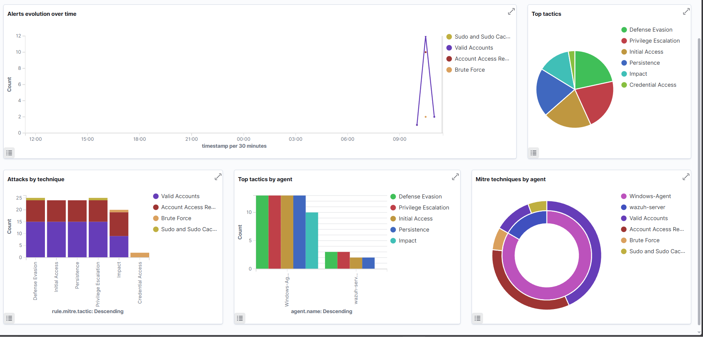
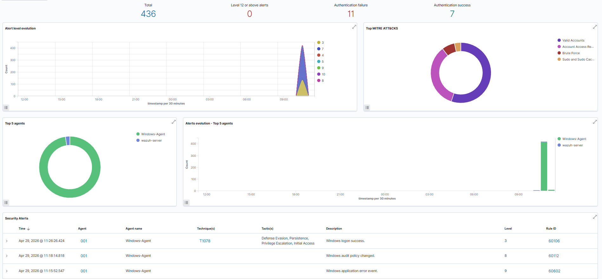

# 🛡️ Wazuh SIEM Home Lab — Attack Detection & Incident Response


## 📌 Project Overview

Built a fully functional Security Operations home lab by deploying 
Wazuh SIEM on Ubuntu Server and connecting a Windows 10 endpoint as 
a monitored agent. Simulated real-world attack techniques, triaged 
alerts, and documented findings in a structured incident report 
following a SOC L1 analyst workflow.

---

## 🛠️ Tools & Technologies

| Tool | Role |
|---|---|
| Wazuh 4.7.5 | SIEM / XDR Platform |
| Ubuntu Server 22.04 | Wazuh Server OS |
| Windows 10 | Monitored Endpoint |
| VirtualBox | Hypervisor |
| PowerShell | Attack Simulation & Verification |

---

## ⚔️ Attacks Simulated

### 1. Brute Force Attack — T1110
**Tool:** PowerShell `net use` command  
**What happened:** Simulated 10 consecutive failed login attempts
against the local administrator account within 34 seconds  
**Wazuh Detection:** 
- Rule 60122 (Level 5) — Individual logon failures
- Rule 60204 (Level 10) — Brute force pattern correlated
- Rule 60115 (Level 9) — Account lockout triggered  
**MITRE Techniques:** T1110, T1078, T1531

### 2. Audit Policy Modification — T1562
**Tool:** PowerShell `auditpol` command  
**What happened:** Enabled process creation auditing on the endpoint  
**Wazuh Detection:** Rule 60112 (Level 8) — Windows audit policy changed  
**MITRE Technique:** T1562 — Impair Defenses

---

## 📊 MITRE ATT&CK Coverage

| Technique ID | Name | Tactic | Detected |
|---|---|---|---|
| T1110 | Brute Force | Credential Access | ✅ |
| T1078 | Valid Accounts | Defense Evasion, Persistence | ✅ |
| T1531 | Account Access Removal | Impact | ✅ |
| T1562 | Impair Defenses | Defense Evasion | ✅ |

---

## 🔍 Key Findings & Alert Analysis

### Brute Force (Event ID 4625)
- 10 failed logon attempts detected within 60 seconds
- Source: Local machine (`\\localhost`)
- Target account: `administrator`
- **SOC Action:** Flag source IP, check for successful logon 
  following failed attempts (Event ID 4624)

### Process Execution (Event ID 4688)
- Suspicious enumeration commands logged under user context
- Commands mapped to Discovery tactic in MITRE ATT&CK
- **SOC Action:** Correlate with logon events to determine if 
  this follows a successful brute force


---

## 📸 Screenshots

### Wazuh Agent Active


### Brute Force Alerts — T1110


### Account Lockout Detection — T1531


### MITRE ATT&CK Coverage Map


### Security Events Overview


---

## 📝 Incident Report

A structured incident report documenting all findings, 
timeline, and recommended response actions is available here:

📄 [View Incident Report](incident-report.md)

---

## 🧠 Skills Demonstrated

- ✅ SIEM deployment and configuration (Wazuh)
- ✅ Linux server administration (Ubuntu)
- ✅ Windows endpoint monitoring and agent deployment
- ✅ Attack simulation using PowerShell-based techniques
- ✅ Alert triage and investigation workflow
- ✅ MITRE ATT&CK framework mapping
- ✅ Incident documentation and reporting
- ✅ Network configuration (VirtualBox Host-Only)
- ✅ PowerShell scripting

---

## 📁 Repository Structure

```
wazuh-siem-homelab/
│
├── README.md                  ← This file
├── incident-report.md         ← Structured incident report
├── screenshots/
│   ├── 01-agent-active.png
│   ├── 02-brute-force-alerts.png
│   ├── 03-account-lockout.png
│   ├── 04-mitre-attack-map.png
│   └── 05-security-overview.png
└── notes/
    └── setup-notes.md         ← Personal notes during setup
```

---

## 🚀 How to Replicate This Lab

1. Install VirtualBox on host machine
2. Deploy Ubuntu Server 22.04 VM (3GB RAM, 25GB disk)
3. Install Wazuh using the official install script
4. Deploy Windows 10 VM (2GB RAM, 50GB disk)
5. Install Wazuh Agent on Windows, point to server IP
6. Simulate brute force attack using PowerShell net use command
7. Enable audit policy and observe policy change detection
8. Investigate correlated alerts in Wazuh dashboard

---

## 👤 Author

**Shubham Singh Darmwal**  
Cyber Security Enthusiast | Aspiring SOC Analyst  
